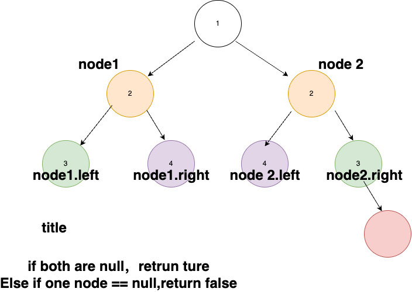
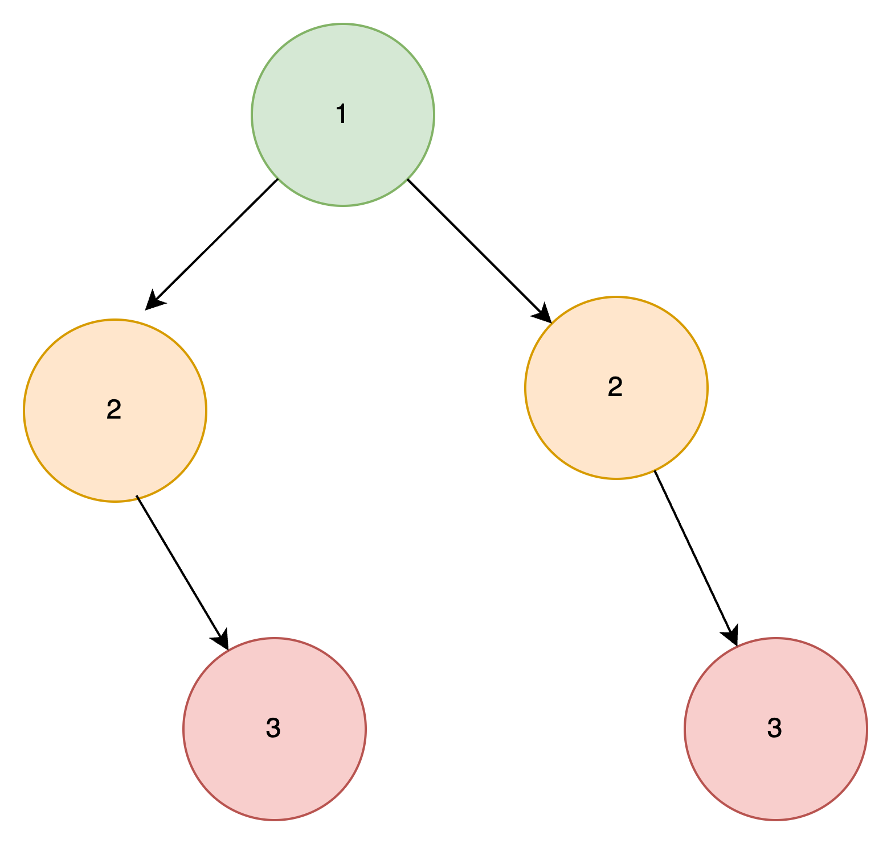

[101. Symmetric Tree](https://leetcode.com/problems/symmetric-tree/)

Given the `root` of a binary tree, *check whether it is a mirror of itself* (i.e., symmetric around its center).

 

**Example 1:**


```
Input: root = [1,2,2,3,4,4,3]
Output: true
```

**Example 2:**


```
Input: root = [1,2,2,null,3,null,3]
Output: false
```

 

**Constraints:**

- The number of nodes in the tree is in the range `[1, 1000]`.
- `-100 <= Node.val <= 100`

 

**Follow up:** Could you solve it both recursively and iteratively?


**Solution:**
递归函数的参数我们设计两个节点node1和node2，分别表示镜相对应的两个节点，递归的时候，一个节点往左边走，另外一个节点往右边走。依次比较是否相等即可，如果存在一队节点不相等，那么说明镜像对称不成立。



```java
class Solution {
    public boolean isSymmetric(TreeNode root) {
        return dfs(root.left,root.right);
    }
    boolean dfs(TreeNode l,TreeNode r){
        if(l==null || r==null) return l==null&&r==null?true:false;
        else return l.val == r.val && dfs(l.left,r.right) && dfs(l.right,r.left);
    }
}
```

可能大家会觉得也可以用层序遍历的方式，每一层如果是回文的那就是 true
，但是这种思路是错的。 如下图，有可能是这样的情况。因此最好还是要 dfs 来做。

