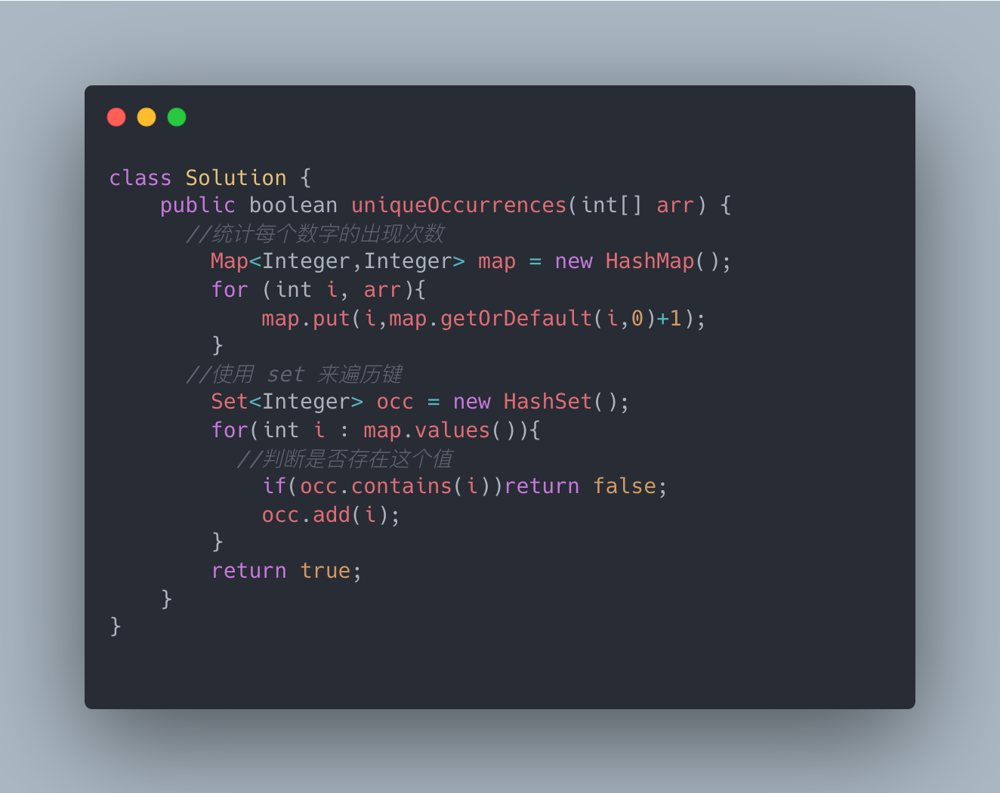

[1207. Unique Number of Occurrences](https://leetcode.com/problems/unique-number-of-occurrences/)

Given an array of integers `arr`, return `true` *if the number of occurrences of each value in the array is **unique** or* `false` *otherwise*.

 

**Example 1:**

```
Input: arr = [1,2,2,1,1,3]
Output: true
Explanation: The value 1 has 3 occurrences, 2 has 2 and 3 has 1. No two values have the same number of occurrences.
```

**Example 2:**

```
Input: arr = [1,2]
Output: false
```

**Example 3:**

```
Input: arr = [-3,0,1,-3,1,1,1,-3,10,0]
Output: true
```

 

**Constraints:**

- `1 <= arr.length <= 1000`
- `-1000 <= arr[i] <= 1000`

**solutions**

So for the hash set,some of you might not very familiar with this structure. 

Hash Set is a data structure implemented using a hash table, primarily used for quickly checking whether an element exists within a collection. It does not store duplicate elements, and the elements are typically unordered.

Hash Map is a data structure that stores data through keys, allowing for fast insertion, deletion, and retrieval of data. It employs a key-value pair mechanism to store data, where each key is unique.

The Set interface is part of the Java Collections Framework and represents a collection that does not allow duplicate elements. It is a more general collection type; HashSet, LinkedHashSet, and TreeSet are all implementations of this interface.

题目解析
首先使用哈希表来统计arr中每个数字的出现次数，然后再遍历记录过的出现次数，再次使用哈希表来进行判断是否重复出现即可。



Hash Set 是一种使用哈希表来实现的数据结构，主要用于快速地检查一个元素是否存在于集合中。它不存储重复的元素，而且通常元素是无序的。

Hash Map 是一种通过键来存储数据的数据结构，可以快速地插入、删除和获取数据。它使用键值对的方式来存储数据，其中键是唯一的。

Set 接口是 Java 集合框架中的一部分，代表了一种不允许重复元素的集合。它是一个更为通用的集合类型，HashSet、LinkedHashSet 和 TreeSet 都是这个接口的实现。