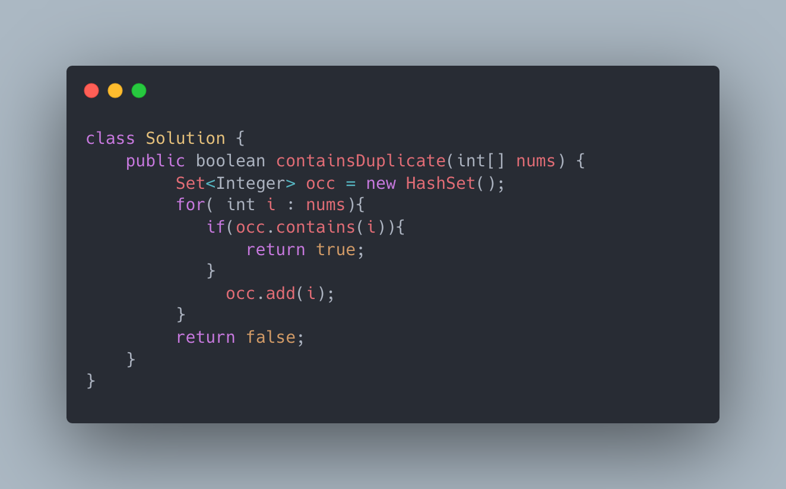

[217. Contains Duplicate](https://leetcode.com/problems/contains-duplicate/)

**Example 1:**

```
Input: nums = [1,2,3,1]
Output: true
```[217. Contains Duplicate](https://leetcode.com/problems/contains-duplicate/)

**Example 1:**

```
Input: nums = [1,2,3,1]
Output: true
```

**Example 2:**

```
Input: nums = [1,2,3,4]
Output: false
```

**Example 3:**

```
Input: nums = [1,1,1,3,3,4,3,2,4,2]
Output: true
```

 

**Constraints:**

- `1 <= nums.length <= 105`
- `-109 <= nums[i] <= 109`

**Example 2:**

```
Input: nums = [1,2,3,4]
Output: false
```

**Example 3:**

```
Input: nums = [1,1,1,3,3,4,3,2,4,2]
Output: true
```

 

**Constraints:**

- `1 <= nums.length <= 105`
- `-109 <= nums[i] <= 109`


**Solutions:**

题目解析
使用哈希表统计每个元素是否出现过即可。


**code**


