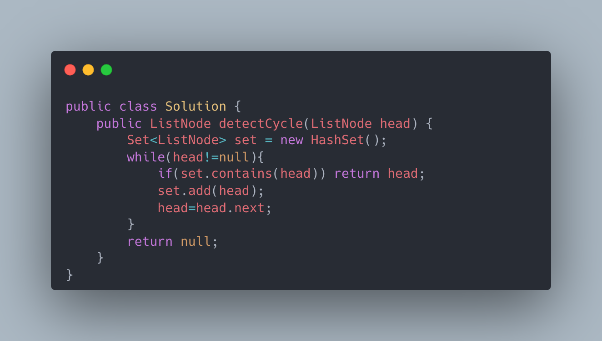
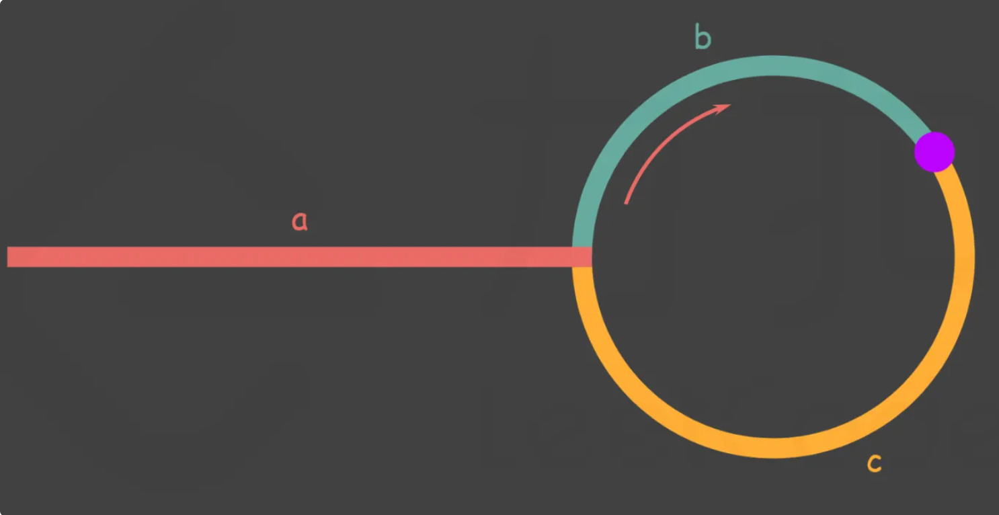
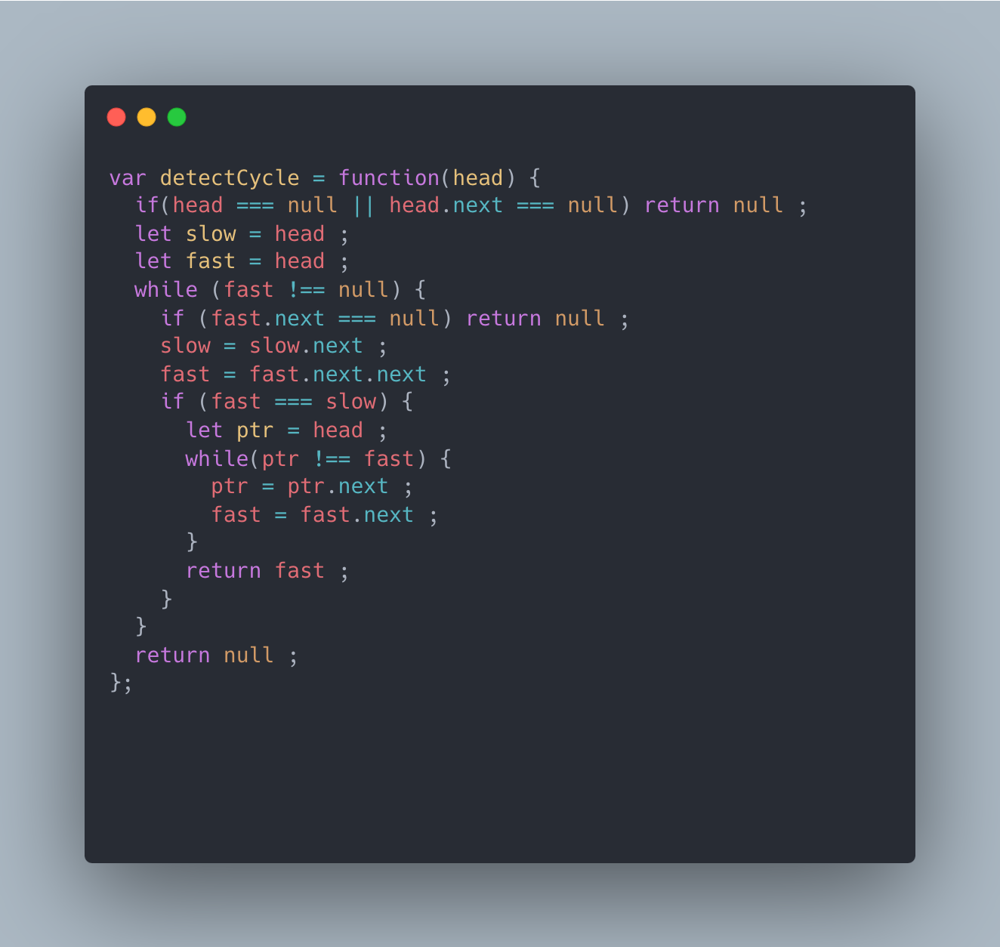

[142. Linked List Cycle II](https://leetcode.com/problems/linked-list-cycle-ii/)


Given the `head` of a linked list, return *the node where the cycle begins. If there is no cycle, return* `null`.

There is a cycle in a linked list if there is some node in the list that can be reached again by continuously following the `next` pointer. Internally, `pos` is used to denote the index of the node that tail's `next` pointer is connected to (**0-indexed**). It is `-1` if there is no cycle. **Note that** `pos` **is not passed as a parameter**.

**Do not modify** the linked list.

 

**Example 1:**


```
Input: head = [3,2,0,-4], pos = 1
Output: tail connects to node index 1
Explanation: There is a cycle in the linked list, where tail connects to the second node.
```

**Example 2:**


```
Input: head = [1,2], pos = 0
Output: tail connects to node index 0
Explanation: There is a cycle in the linked list, where tail connects to the first node.
```

**Example 3:**


```
Input: head = [1], pos = -1
Output: no cycle
Explanation: There is no cycle in the linked list.
```

 

**Constraints:**

- The number of the nodes in the list is in the range `[0, 104]`.
- `-105 <= Node.val <= 105`
- `pos` is `-1` or a **valid index** in the linked-list.

 

**Follow up:** Can you solve it using `O(1)` (i.e. constant) memory?


**Solution:**


The most intuitive feeling for this problem is to use a hash table. Every time a node is accessed, it is judged whether the node exists in the hash table. If it exists, it indicates a loop and returns the node directly. Otherwise, just put the node into the hash table. If it has not returned until the end of the linked list, null is returned. The time complexity of this method is O(n), but the space is also O(n), which is not the optimal solution.



The **best** solution to this problem is to use double pointers.
We use two pointers, fast and slow. 

They all start at the head of the linked list. Subsequently, the slow pointer moves backward one position at a time, while the fast pointer moves backward two positions. If there is a cycle in the linked list, the fast pointer will eventually meet the slow pointer in the cycle again.



As shown in the figure, let the length of the outer part of the linked list be a. After the slow pointer enters the ring, it travels a distance b to meet fast. At this point, the fast pointer has completed n rounds of the ring, so the total distance it has traveled is `a+n(b+c)+b=a+(n+1)b+nc`

According to the meaning of the question, at any time, the distance traveled by the fast pointer is `twice` that of the slow pointer. 

Therefore, we have

`a+(n+1)b+nc=2(a+b) a=c+(n−1)(b+c)`

With the equivalence relationship `a=c+(n−1)(b+c)`.

We will find that: `the distance from the meeting point to the loop entry point plus the loop length of n−1 circles` is exactly `equal` to `the distance from the head of the linked list to Distance from the loop entry point.`

Therefore, when we find that slow and fast meet, we use an additional pointer ptr. 

Initially, it points to the head of the linked list; 

subsequently, it and fast move backward together one position at a time. 

Eventually, they will meet at the loop entry point.
 

