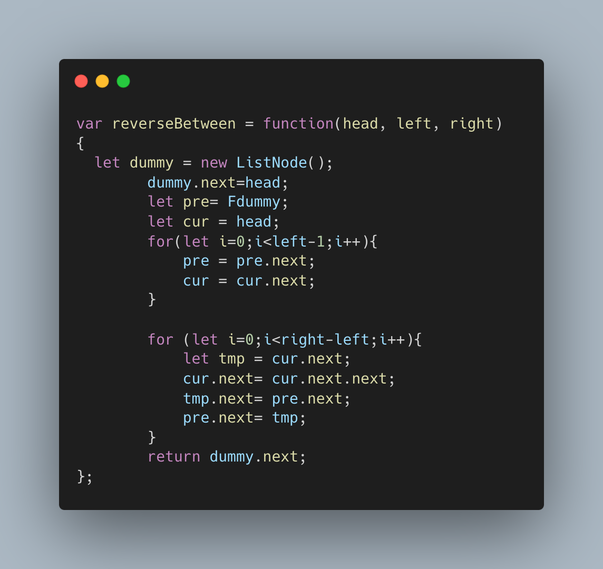

[19. Remove Nth Node From End of List](https://leetcode.com/problems/remove-nth-node-from-end-of-list/)


Given the `head` of a linked list, remove the `nth` node from the end of the list and return its head.

 

**Example 1:**


```
Input: head = [1,2,3,4,5], n = 2
Output: [1,2,3,5]
```

**Example 2:**

```
Input: head = [1], n = 1
Output: []
```

**Example 3:**

```
Input: head = [1,2], n = 1
Output: [1]
```

 

**Constraints:**

- The number of nodes in the list is `sz`.
- `1 <= sz <= 30`
- `0 <= Node.val <= 100`
- `1 <= n <= sz`

 

**Follow up:** Could you do this in one pass?

**Solutions:**

The idea of ​​this question is dual pointers/fast and slow pointers.

The fast pointer first moves n steps, then the slow pointer and the fast pointer move together until the fast pointer reaches the end node.

At this time, the next node of the slow pointer is the node we need to delete.


**Solution:**


**Code:**

