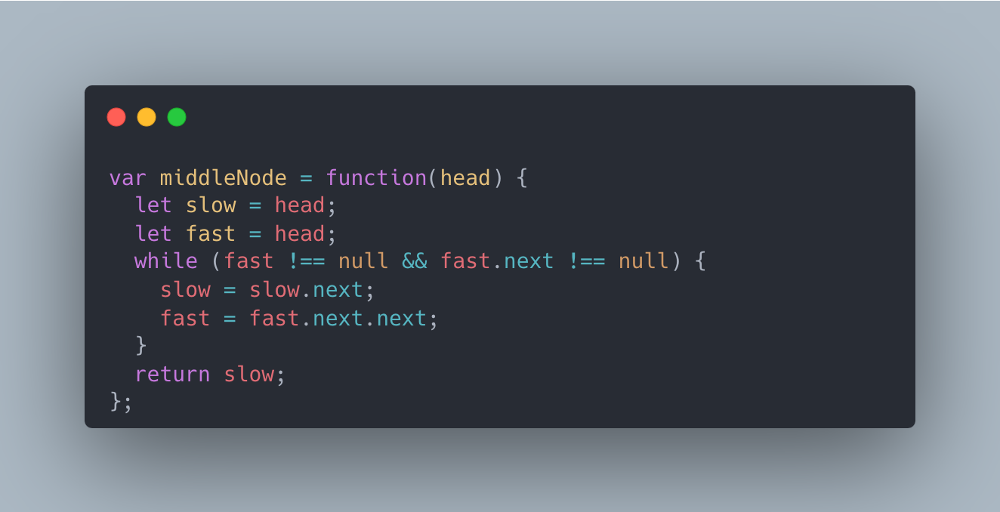

[876. Middle of the Linked List](https://leetcode.com/problems/middle-of-the-linked-list/)

Given the `head` of a singly linked list, return *the middle node of the linked list*.

If there are two middle nodes, return **the second middle** node.

 

**Example 1:**


```
Input: head = [1,2,3,4,5]
Output: [3,4,5]
Explanation: The middle node of the list is node 3.
```

**Example 2:**


```
Input: head = [1,2,3,4,5,6]
Output: [4,5,6]
Explanation: Since the list has two middle nodes with values 3 and 4, we return the second one.
```

 

**Constraints:**

- The number of nodes in the list is in the range `[1, 100]`.
- `1 <= Node.val <= 100`

**Solution:**

Question analysis

**The first method is to use two loops**

Let a pointer go to the node of the linked list for the first time and calculate the length of the linked list.
The second time, let a pointer move half of the calculated length.

**The second method**

This question can use the idea of double pointers/fast and slow pointers.
The slow pointer takes one step at a time, and the fast pointer takes two steps at a time. When fast reaches the end node, the slow pointer is the middle node.


