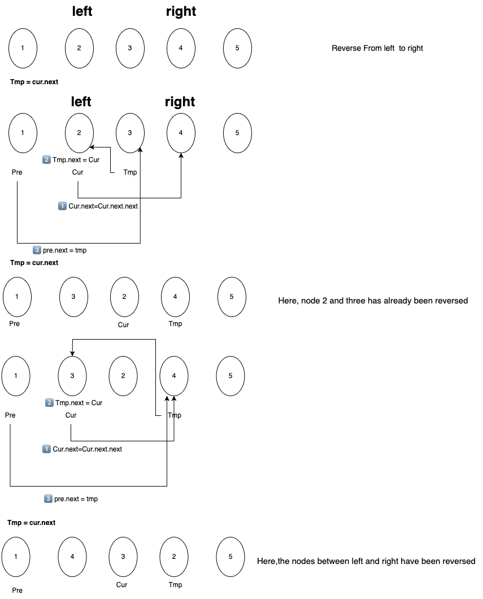
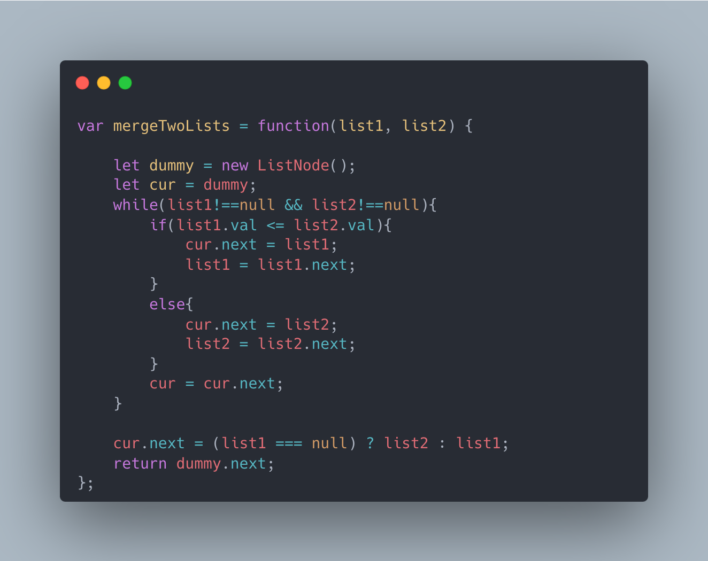

[92. Reverse Linked List II](https://leetcode.com/problems/reverse-linked-list-ii/description/)


**Example 1:**
```
Input: head = [1,2,3,4,5], left = 2, right = 4
Output: [1,4,3,2,5]
```

**Example 2:**

```
Input: head = [5], left = 1, right = 1
Output: [5]
```


**Constraints:**

- The number of nodes in the list is `n`.
- `1 <= n <= 500`
- `-500 <= Node.val <= 500`
- `1 <= left <= right <= n`

**Solution:**



**Code:**



