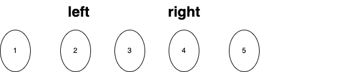

**Guide for Data Structures and Algorithms!**

Data structures and algorithms are essential topics in computer science. They form the foundation for building efficient and scalable software systems, whether you are looking to enter the software development industry, enhance your career skills, or prepare for interviews.

Hope this guide will serve as a good starting point for your journey to learn data structures and algorithms, providing strong support for your programming journey. 

## Reverse list 

